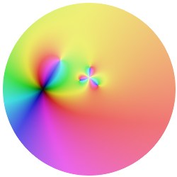

# complex

*LFE support for numbers both real and imagined*



## Introduction

This library provides a data type (LFE record) for complex numbers as well as
many mathematical operations which support the complex data type. For a full
list of functions in the API, see the bottom of this README file.


## Installation

Just add it to your ``rebar.config`` deps:

```erlang
  {deps, [
    ...
    {complex, ".*",
      {git, "git@github.com:lfex/complex.git", "master"}}
      ]}.
```

And then do the usual:

```bash
    $ make
```


## Usage

Create some new complex numbers and print them:

```cl
> (set z1 (complex:new 4 -2))
#(complex 4 -2)
> (set z2 (complex:new 4 2))
#(complex 4 2)
> (complex:print z1)
4 -2i
ok
> (complex:print z2)
4 +2i
ok
```

Convenience functions:

```cl
> (complex:one)
#(complex 1 0)
> (complex:i)
#(complex 0 1)
```

For the rest of the usage, we'll just ``slurp`` so that the calls are easier to type:

```cl
> (slurp "src/complex.lfe")
#(ok complex)
```

Using exponents to demonstrate the cyclic values of the powers of *i*:

```cl
> (print (pow (i) 0))
1 +0i
ok
> (print (pow (i) 1))
0 +1i
ok
> (print (pow (i) 2))
-1 +0i
ok
> (print (pow (i) 3))
0 -1i
ok
> (print (pow (i) 4))
1 +0i
ok
```

Complex arithmatic and operations (note that ``complex/2`` is an alias for
``new/2``; it just looks nicer when not using the module name):

```cl
> (add (complex 4 2) (i))
#(complex 4 3)
> (sub (complex 4 2) (i))
#(complex 4 1)
> (mult (complex 4 2) (i))
#(complex -2 4)
> (div (complex 4 2) (i))
#(complex 2.0 -4.0)
```

```cl
> (conj z2)
#(complex 4 -2)
> (eq z1 z2)
false
> (eq z1 (conj z2))
true
> (inv z1)
#(complex 0.2 0.1)
> (inv z2)
#(complex 0.2 -0.1)
> (abs z1)
4.47213595499958
> (abs z1 #(complex))
#(complex 4.47213595499958 0)
```

```cl
> (print (sqrt (complex -1 0)))
0.0 +1.0i
ok
> (eq (sqrt (complex -1 0)) (i))
true
```

See the [unit tests](tests) for a greater number of examples.

## API

The list of functions supported by the complex library are as follows:

```cl
complex:->str/1
complex:abs/1
complex:abs/2
complex:add/2
complex:arg/1
complex:complex/2
complex:complex?/1
complex:conj/1
complex:cos/1
complex:cot/1
complex:csc/1
complex:div/2
complex:eeq/2
complex:eq/2
complex:eq/3
complex:exp/1
complex:i/0
complex:imag/1
complex:inv/1
complex:ln/1
complex:modulus/1
complex:mult/2
complex:neg/1
complex:new/0
complex:new/1
complex:new/2
complex:one/0
complex:phase/1
complex:pow/2
complex:print/1
complex:real/1
complex:sec/1
complex:sign/1
complex:sin/1
complex:sqrt/1
complex:sub/2
complex:tan/1
```

This list is just part of what's actually planned and in-progress. More coming soon!
